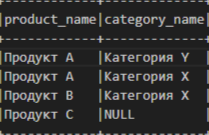

## PySpark


Чтобы запустить PySpark код и проверить, что всё работает:

Перейти в папку с проектом 
```bash
cd py_spark
```
Создать виртуальное окружение:
   Команда для Windows: -
```bash
python -m venv venv
```
Команда для Linux и macOS: - 
```bash
python3 -m venv venv
```
Активировать виртуальное окружение:
   Команда для Windows: -
```bash
source venv/Scripts/activate
```
Для Linux и macOS: -
```bash
source venv/bin/activate
```
Обновить пакетный менеджер:
   Для Windows: -
```bash
python -m pip install --upgrade pip
```
Для Linux и macOS: -
```bash
python3 -m pip install --upgrade pip
```
Установите pyspark:
```bash
pip install pyspark
```
Чтобы запустить PySpark код и проверить, что всё работает:
В терминале или командной строке перейдите в папку с файлом и выполните:
```bash
python test_pyspark.py
```
Посмотрите вывод



